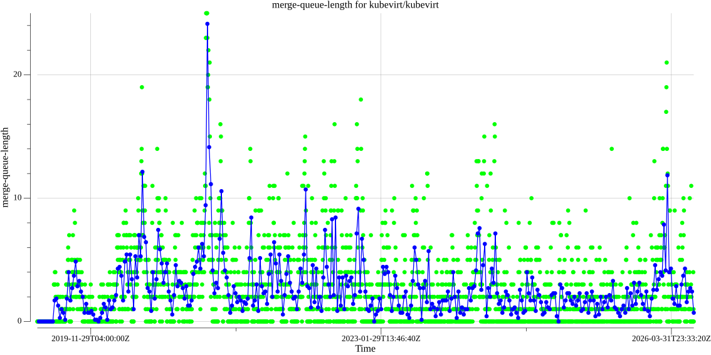
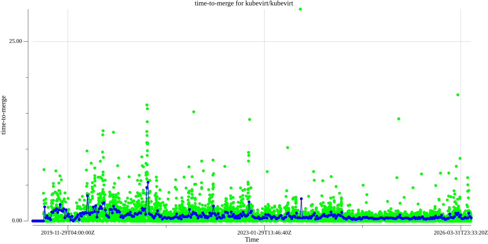
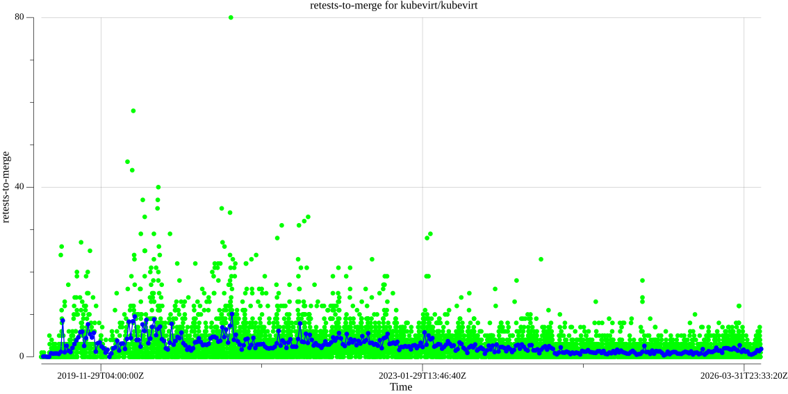
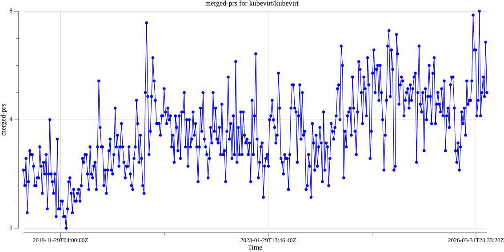

# 🏥 ci-health


This repo contains code to calculate metrics about the performance of CI systems based on Prow.

---

## 📋 Table of Contents

- [📖 Definitions](#-definitions)
- [📊 Status](#-status)
  - [kubevirt/kubevirt Metrics](#kubevirtkubevirt)
  - [Failures per SIG](#failures-per-sig-against-last-code-push-for-merged-prs)
  - [Quarantined Tests](#quarantined-tests-per-sig)
  - [Top Failed Lanes](#top-failed-lanes)
- [📈 Historical Data Evolution](#-historical-data-evolution)
- [⚙️ Commands](#️-commands)
- [🔧 Local Execution](#-local-execution)
  - [stats command](#stats-command)
  - [batch command](#batch-command)
  - [html-report command](#html-report-command)

---

## 📖 Definitions

| Term | Description |
|------|-------------|
| **Merge queue** | List of Pull Requests that are ready to be merged at any given date. For being ready to be merged they must:<br/>• Have the `lgtm` label<br/>• Have the `approved` label<br/>• Not have any label matching `do-not-merge/*` (e.g., `do-not-merge/hold`, `do-not-merge/work-in-progress`)<br/>• Not have any label matching `needs-*` (e.g., `needs-rebase`, `needs-ok-to-test`) |
| **Merge queue length** | Number of PRs in the merge queue at a given time |
| **Time to merge** | For each merged PR, the time in days it took since it entered the merge queue for the last time until it got finally merged |
| **Retests to merge** | For each merged PR, how many `/test` and `/retest` comments were issued after the last code push |

## 📊 Status

> **ℹ️ Note:** This status is updated every 3 hours. The average values are calculated with data from the previous 7 days since the execution time.

### kubevirt/kubevirt

<div align="center">

| Metric | Badge |
|--------|-------|
| **Average Merge Queue Length** |  |
| **Average Time to Merge** |  |
| **Average Retests to Merge** |  |
| **Merged PRs with No Retest** |  |

</div>

**📊 Data Sources:**
- [Latest execution data](https://kubevirt.io/ci-health/output/kubevirt/kubevirt/results.json)
- [Latest weeks data](https://grafana.ci.kubevirt.io/d/WZU1-LPGz/merge-queue)

### 🚨 Failures per SIG against last code push for merged PRs

> **⚠️ Impact:** These badges display the number of failures per SIG against merged PRs from the last 7 days. Each of these failures contribute to the number of retests that occur in CI and delay the time to merge for PRs.

<div align="center">

| SIG | Failures | Report |
|-----|----------|--------|
| **Compute** | [](https://storage.googleapis.com/kubevirt-prow/reports/sig-failure-reports/sig-compute-failure-report.html) | [📊 View Report](https://storage.googleapis.com/kubevirt-prow/reports/sig-failure-reports/sig-compute-failure-report.html) |
| **Storage** | [](https://storage.googleapis.com/kubevirt-prow/reports/sig-failure-reports/sig-storage-failure-report.html) | [📊 View Report](https://storage.googleapis.com/kubevirt-prow/reports/sig-failure-reports/sig-storage-failure-report.html) |
| **Network** | [](https://storage.googleapis.com/kubevirt-prow/reports/sig-failure-reports/sig-network-failure-report.html) | [📊 View Report](https://storage.googleapis.com/kubevirt-prow/reports/sig-failure-reports/sig-network-failure-report.html) |
| **Operator** | [](https://storage.googleapis.com/kubevirt-prow/reports/sig-failure-reports/sig-compute-failure-report.html) | [📊 View Report](https://storage.googleapis.com/kubevirt-prow/reports/sig-failure-reports/sig-compute-failure-report.html) |
| **CI** |  | - |
| **Monitoring** |  | - |

</div>


### 🔒 Quarantined Tests Per SIG

> **📋 Details:** These badges display the number of tests that are currently quarantined per SIG. More details on these tests can be found [here](https://storage.googleapis.com/kubevirt-prow/reports/quarantined-tests/kubevirt/kubevirt/index.html).

<div align="center">

| SIG | Quarantined Tests |
|-----|-------------------|
| **Compute** |  |
| **Storage** |  |
| **Network** |  |
| **Monitoring** |  |
| **Total** |  |

</div>

<details>
<summary><h3>🔥 Top Failed Lanes</h3></summary>

> **🔍 Details:** The links to each of these failed jobs can be found in the [latest execution data](https://kubevirt.io/ci-health/output/kubevirt/kubevirt/results.json) under the SIGRetests section.

<div align="center">

| Rank | Failed Job |
|------|------------|
| **#1** |  |
| **#2** |  |
| **#3** |  |
| **#4** |  |
| **#5** |  |
| **#6** |  |
| **#7** |  |
| **#8** |  |
| **#9** |  |
| **#10** |  |

</div>

</details>

---

<details>
<summary><h2>📈 Historical Data Evolution</h2></summary>

> **⏰ Update Schedule:** These plots will be updated every week.

<div align="center">

| Metric | Trend Plot | Raw Data |
|--------|------------|----------|
| **Merge Queue Length** |  | [📊 Data](./output/kubevirt/kubevirt/batch/merge-queue-length/data) |
| **Time to Merge** |  | [📊 Data](./output/kubevirt/kubevirt/batch/time-to-merge/data) |
| **Retests to Merge** |  | [📊 Data](./output/kubevirt/kubevirt/batch/retests-to-merge/data) |
| **Merged PRs per Day** |  | [📊 Data](./output/kubevirt/kubevirt/batch/merged-prs/data) |

</div>

</details>

---

## ⚙️ Commands

The tool provides the following commands:

| Command | Description |
|---------|-------------|
| **`stats`** | Gathers latest data and generates badges data and files |
| **`batch`** | Gathers data for a range of dates and generates plots from them |
| **`html-report`** | Generates HTML reports of test case failures per SIG |

---

## 🔧 Local Execution

You can execute the tool locally to grab the stats of a specific repo that uses Prow.

### 📋 Requirements

| Requirement | Description |
|-------------|-------------|
| **Go v1.22** | Required for building and running the tool |
| **GitHub Token** | Must have `public_repo` permission (required for GitHub API queries) |

### 📊 stats command

**Basic Usage:**
```bash
go run ./cmd/stats --gh-token /path/to/token --source <org/repo> --path /path/to/output/dir --data-days <days-to-query>
```

**Parameters:**

| Parameter | Description |
|-----------|-------------|
| `--gh-token` | Path to the file containing your GitHub token |
| `--source` | Organization and repo to query (e.g., `kubevirt/kubevirt`) |
| `--path` | Path to store output data |
| `--data-days` | Number of days to query |

**Examples:**

```bash
# Get help
go run ./cmd/stats --help

# Query last 7 days of kubevirt/kubevirt
go run ./cmd/stats --gh-token ${GITHUB_TOKEN} --source kubevirt/kubevirt --path /tmp/ci-health --data-days 7
```

### 📈 batch command

Batch executions are done in two modes:

| Mode | Description |
|------|-------------|
| **`fetch`** | Gathers the data |
| **`plot`** | Generates a PNG file with the data previously fetched |

**Basic Usage:**
```bash
# Fetch mode
go run ./cmd/batch --gh-token /path/to/token --source <org/repo> --path $(pwd)/output --mode fetch --target-metric merged-prs --start-date 2020-05-19

# Plot mode (requires data from fetch mode)
go run ./cmd/batch --gh-token /path/to/token --source <org/repo> --path $(pwd)/output --mode plot --target-metric merged-prs --start-date 2020-05-19
```

**Parameters:**

| Parameter | Description |
|-----------|-------------|
| `--gh-token` | Path to the file containing your GitHub token |
| `--source` | Organization and repo to query |
| `--path` | Path to store output data |
| `--target-metric` | Metric to query |
| `--start-date` | Oldest date from which data will be queried (until today) |

```bash
# Get help
go run ./cmd/batch --help
```

### 📄 html-report command

Generates HTML reports of test case failures per SIG.

**Basic Usage:**
```bash
go run ./cmd/html-report --sig compute --results-path ./output/kubevirt/kubevirt/results.json --path /tmp/
```

**Parameters:**

| Parameter | Description |
|-----------|-------------|
| `--sig` | SIG name (e.g., `compute`, `storage`, `network`) |
| `--results-path` | Path to the results.json file |
| `--path` | Output directory for the HTML report |

**Output:** Creates an HTML report named `sig-<sig-name>-failure-report.html` in the specified path.
