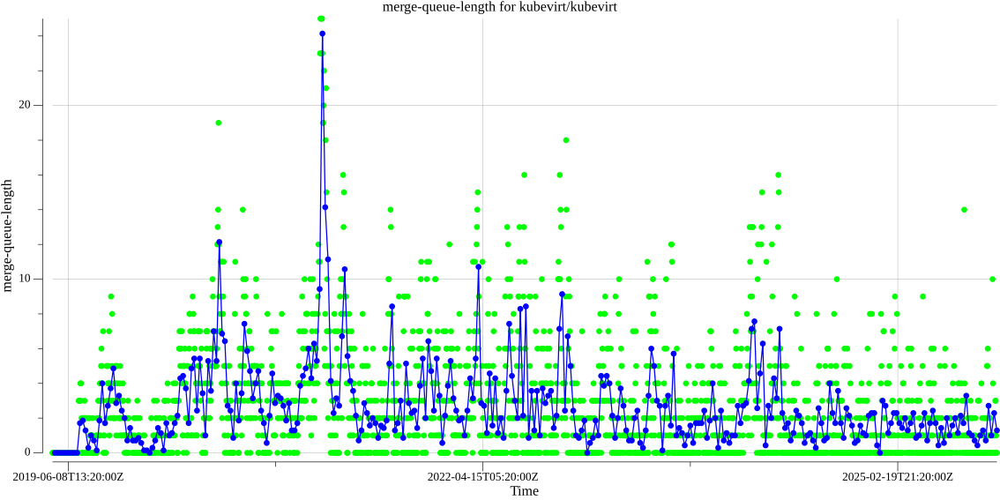
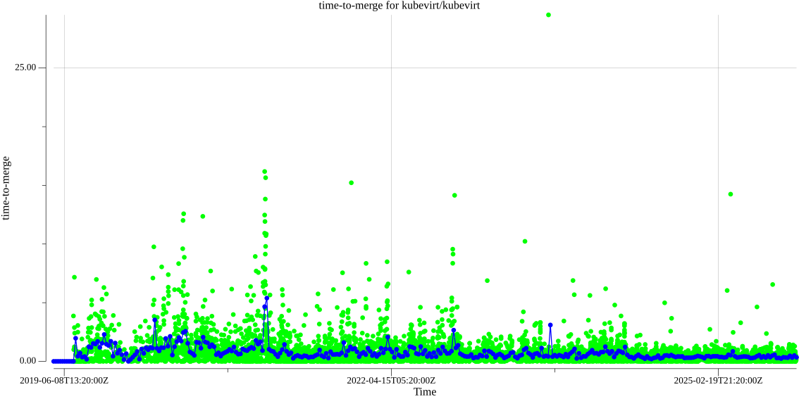
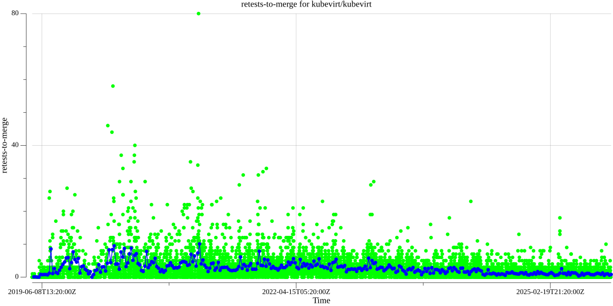
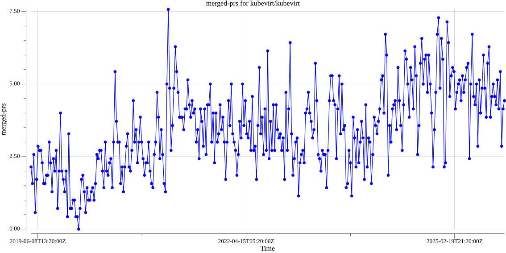

# ci-health


This repo contains code to calculate metrics about the performance of CI systems
based on Prow.

## Definitions

* Merge queue: list of Pull Requests that are ready to be merged at any given
date. For being ready to be merged they must:

  * Have the `lgtm` label.
  * Have the `approved` label.
  * Not have any label matching `do-not-merge/*`, i.e. `do-not-merge/hold`,  `do-not-merge/work-in-progress` etc. .
  * Not have any label matching `needs-*`, i.e. `needs-rebase`, `needs-ok-to-test` etc. .

* Merge queue length: number of PRs in the merge queue at a given time.
* Time to merge: for each merged PR, the time in days it took since it entered the merge
queue for the last time until it got finally merged.
* Retests to merge: for each merged PR, how many `/test` and `/retest` comments
were issued after the last code push.

## Status
This status is updated every 3 hours. The average values are calculated with
data from the previous 7 days since the execution time.

### kubevirt/kubevirt


[Latest execution data](https://kubevirt.io/ci-health/output/kubevirt/kubevirt/results.json)

[Latest weeks data](https://grafana.ci.kubevirt.io/d/WZU1-LPGz/merge-queue)

### Failures per SIG against last code push for merged PRs

These badges display the number of failures per SIG against merged PRs from the last 7 days.

Each of these failures contribute to the number of retests that occur in CI and delay the time to merge for PRs.


Top failed lanes:


The links to each of these failed jobs can be found in the [latest execution data](https://kubevirt.io/ci-health/output/kubevirt/kubevirt/results.json)
under the SIGRetests section

## Historical data evolution

These plots will be updated every week.

* kubevirt/kubevirt merge queue length:
  

  Data available [here](./output/kubevirt/kubevirt/batch/merge-queue-length/data).

* kubevirt/kubevirt time to merge:
  

  Data available [here](./output/kubevirt/kubevirt/batch/time-to-merge/data).

* kubevirt/kubevirt retests to merge:
  

  Data available [here](./output/kubevirt/kubevirt/batch/retests-to-merge/data).

* kubevirt/kubevirt merged PRs per day:
  

  Data available [here](./output/kubevirt/kubevirt/batch/merged-prs/data).

## Commands

The tool has two different commands:

* `stats`: gathers latest data and generates badges data and files.

* `batch`: gathers data for a range of dates and generates plots from them.

## Local execution
You can execute the tool locally to grab the stats of an specific repo that uses
Prow, these are the requirements:

* [Bazelisk](https://github.com/bazelbuild/bazelisk)
* A GitHub token with `public_repo` permission, it is required because the tool
queries GitHub's API

### stats command

A generic stats command execution from the repo's root looks like:
```
$ bazelisk run //cmd/stats -- --gh-token /path/to/token --source <org/repo> --path /path/to/output/dir --data-days <days-to-query>
```
where:
* `--gh-token`: should contain the path of the file where you saved your GitHub
token.
* `--source`: is the organization and repo to query information from.
* `--path`: is the path to store output data.
* `--data-days`: is the number of days to query.

You can check all the available options with:
```
$ bazelisk run //cmd/stats -- --help
```
So, for instance, if you have stored the path of your GitHub token file in a
`GITHUB_TOKEN` environment variable, a query for the last four days of
kubevirt/kubevirt can look like:
```
$ bazelisk run //cmd/stats -- --gh-token ${GITHUB_TOKEN} --source kubevirt/kubevirt --path /tmp/ci-health --data-days 7
```

### batch command

batch executions are done in two modes:
* `fetch`: gathers the data
* `plot`: generates a png file with the data previously fetched.

A generic fetch batch command execution from the repo's root looks like:
```
$ bazelisk run //cmd/batch -- --gh-token /path/to/token --source <org/repo> --path $(pwd)/output --mode fetch --target-metric merged-prs --start-date 2020-05-19
```
where:
* `--gh-token`: should contain the path of the file where you saved your GitHub
token.
* `--source`: is the organization and repo to query information from.
* `--path`: is the path to store output data.
* `--target-metric`: is the metric to query.
* `--start-date`: is oldest date from which the data will be queried, until today.

You can check all the available options with:
```
$ bazelisk run //cmd/batch -- --help
```
To generate plots you should execute:
```
$ bazelisk run //cmd/batch -- --gh-token /path/to/token --source <org/repo> --path $(pwd)/output --mode plot --target-metric merged-prs --start-date 2020-05-19
```
Plot mode requires data previously generated by fetch mode.
