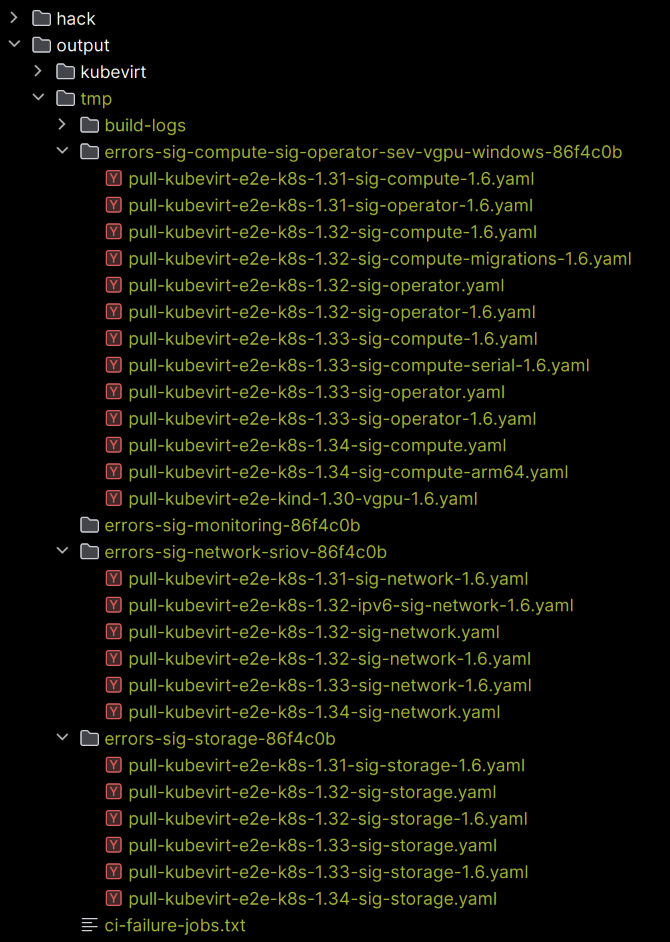

# ci-failures

A cli tool that extracts information about jobs that have failed before the
test phase for a lane has started.

I.e. it filters failed jobs on the junit information missing, which is a clear
indication that the test phase has not started.

In it's current state the tool does the following:

It extracts the job urls for the jobs that have failed matching above criteria.
It then creates a text file containing all these urls `output/tmp/ci-failure-jobs.txt`.

Then it downloads the build logs for the jobs (each file with path
`output/tmp/build-logs/{build-id}.txt`) and converts these into yaml for
further processing. 

The information in the yaml files is put into folders per sig,
then failures in builds are collected in one file per job - a release
branch job counts as a separate job instance - producing the following structure:



Each of the files for a job is structured like this 

```yaml
job_name: pull-kubevirt-e2e-k8s-1.31-sig-compute-1.6
build_errors:
    - job_url: https://prow.ci.kubevirt.io//view/gs/kubevirt-prow/pr-logs/pull/kubevirt_kubevirt/16536/pull-kubevirt-e2e-k8s-1.31-sig-compute-1.6/2011366039224324096
      build_id: 2011366039224324096
      build_log_error_snippets:
        - start_line: 257
          content: |
            09:17:20: Repository rule rpm defined at:
            09:17:20:   /tmp/cache/bazel/18316b1300bb8985bc913139d5cc6323/external/bazeldnf/internal/rpm.bzl:48:22: in <toplevel>
            09:17:20: WARNING: Download from http://mirror.stream.centos.org/9-stream/AppStream/x86_64/os/Packages/libvirt-daemon-driver-storage-core-10.10.0-13.el9.x86_64.rpm failed: class java.io.FileNotFoundException GET returned 404 Not Found
            09:17:20: ERROR: An error occurred during the fetch of repository 'libvirt-daemon-driver-storage-core-0__10.10.0-13.el9.x86_64':
            09:17:20:    Traceback (most recent call last):
        - start_line: 262
          content: |
            ...
```
