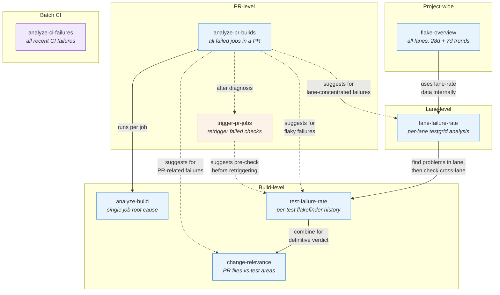

# CI Health Skills Overview

Skills in `.claude/skills/` provide CI failure analysis, flake detection, and PR triage for the KubeVirt project. They are invoked by Claude Code as slash commands.

## Skills by Scope

| Scope | Skills | Input |
|-------|--------|-------|
| **Single build** | `analyze-build`, `test-failure-rate`, `change-relevance` | Prow job URL |
| **Single PR** | `analyze-pr-builds`, `trigger-pr-jobs` | GitHub PR URL |
| **All recent CI** | `analyze-ci-failures`, `lane-failure-rate`, `flake-overview` | No URL / testgrid URL |

## Skill Descriptions

### analyze-build

Deep root-cause analysis of one failed Prow job. Extracts build log errors, k8s cluster state (pods, nodes, events, VMIs), etcd profiling, and container logs. Classifies as infrastructure flake vs. test failure.

**Input:** A Prow job URL pointing to a specific build, e.g.
`https://prow.ci.kubevirt.io/view/gs/kubevirt-prow/pr-logs/pull/kubevirt_kubevirt/16885/pull-kubevirt-e2e-k8s-1.34-windows2016/2034979182789791744`

### analyze-ci-failures

Batch analysis of all recent CI failures from `results.json`. Groups failures by root cause across SIGs, detects cross-PR flakes, and identifies infrastructure events within time windows.

**Input:** None — operates on the pre-existing `output/kubevirt/kubevirt/results.json` data file in the ci-health repository.

### analyze-pr-builds

Analyzes all currently-failing builds for a PR. Runs build-level analysis across every failed job, then correlates cross-job patterns (same test in many jobs suggests PR-caused; different tests suggest flakes).

**Input:** A GitHub pull request URL, e.g.
`https://github.com/kubevirt/kubevirt/pull/17287`

### test-failure-rate

Looks up historical success rates for a build's failed tests using flakefinder data. Classifies each test as flaky, PR-related, or infrastructure-related by analyzing dispersion across lanes and k8s versions.

**Input:** A Prow job URL pointing to a specific build (same format as `analyze-build`). Optional `--days` flag (default 7, max 28) to extend the analysis window.

### change-relevance

Maps a PR's changed files to SIG code areas, then checks whether the failing tests overlap those areas. Classifies each failure as `related`, `possibly-related`, `unrelated`, or `unknown`. Only works for PR builds (URLs containing `pr-logs/pull/`); periodic builds are not supported.

**Input:** A Prow job URL for a PR build, e.g.
`https://prow.ci.kubevirt.io/view/gs/kubevirt-prow/pr-logs/pull/kubevirt_kubevirt/17760/pull-kubevirt-e2e-kind-1.35-sig-compute-arm64/2053843644594524160`

### lane-failure-rate

Lane-wide analysis from testgrid. Computes per-test failure rates for every test in a lane, with flip-rate analysis, burst detection, and cross-test correlation. Includes a `discover-lanes` subcommand for finding all lanes matching a k8s version.

**Input (lane-rate):** A testgrid URL identifying a lane, e.g.
`https://testgrid.k8s.io/kubevirt-periodics#periodic-kubevirt-e2e-k8s-1.36-sig-storage`
Optional `--days` flag (default 14) and `--max-success-rate` filter (useful for noisy presubmit lanes).

**Input (discover-lanes):** A Kubernetes version string, e.g. `1.36`. Returns all matching periodic and presubmit lanes.

### flake-overview

Project-wide flake report combining flakefinder (PR-based) and testgrid (periodic) data. Runs 28-day and 7-day windows for trend detection, resolves test source locations, and produces a markdown report grouped by SIG with quarantine prioritization.

**Input:** None — fetches flakefinder and testgrid data automatically. Uses a `--days` flag (run twice: once with `--days 28`, once with `--days 7`) to produce the two windows needed for trend comparison.

### trigger-pr-jobs

Operational skill: finds missing or failed required checks on a PR and posts `/test` commands to retrigger them.

**Input:** A GitHub pull request URL, e.g.
`https://github.com/kubevirt/kubevirt/pull/17287`

## How the Skills Relate

### Key Relationships

- **`analyze-pr-builds` is the PR entry point** — it runs `analyze-build` on every failed job in a PR, then suggests three follow-up skills depending on what it finds.
- **`test-failure-rate` + `change-relevance` form a decision matrix** — together they answer "is this test historically flaky?" and "did this PR touch the test's code area?" The `change-relevance` skill includes a combined verdict table mapping all combinations.
- **`lane-failure-rate` feeds into `test-failure-rate`** — lane-failure-rate finds which tests are problematic in a lane; test-failure-rate then checks if those tests also fail across other lanes.
- **`flake-overview` aggregates `lane-failure-rate`** — it runs lane-rate analysis across all lanes and combines it with flakefinder data to produce a project-wide quarantine-prioritized report.
- **`trigger-pr-jobs` is the only action skill** — the others are diagnostic. It suggests running `test-failure-rate` first to decide whether retriggering is worthwhile.
- **`analyze-ci-failures` stands alone** — it operates on all recent CI failures from `results.json` rather than a specific build or PR.
